# Food Porter — Complete User Handbook

*The Rajyash Foundation food-rescue platform · screen-by-screen guide for every user*

This handbook covers the whole web app, screen by screen, for everyone who uses it:
**donors** who share surplus food, **volunteers** who help distribute it, **drivers** who
collect the food and run the delivery route, and **foundation staff (admins)** who coordinate
everything. It doubles as the **training and support reference** for the foundation team — each
persona section is written for the person who uses it, and the admin section goes deep enough to
train and support others.

> **How the rescue works (the real-world model).** A donor posts surplus food. The foundation's
> **driver collects it** — either by claiming it from a driver board or being assigned it by
> staff into a run — and drives it to a **distribution point**. **Volunteers never collect.**
> They ride along or meet the run at the drop to help **distribute** the food and confirm it
> reached people, and they can watch a rescue's progress for awareness. Staff coordinate pickups
> into delivery **runs**, build and adjust those runs, and watch everything live on one dashboard.

Every action documented below exists in the live app today — the notification bell, the
run-driver reassignment control, the run-edit form, the per-stop status override, and the
driver-only pickup assignment picker were all recent additions that closed gaps in earlier
builds; this handbook reflects the app **with those gaps closed**.

---

## Contents

1. [For everyone — roles, signing in, onboarding, top bar, notifications](#1-for-everyone)
2. [The public website (homepage & visitors)](#2-the-public-website)
3. [Donor guide](#3-donor-guide)
4. [Volunteer guide](#4-volunteer-guide)
5. [Driver guide](#5-driver-guide)
6. [Admin / staff guide](#6-admin-staff-guide)
7. [Appendix — the rescue loop, status glossaries, languages, support](#7-appendix)

---

## 1. For everyone

### The four roles

| Role | Who they are | What they do in the app |
|------|--------------|--------------------------|
| **Donor** | A restaurant, hostel, family, or event host with surplus food | Posts food for pickup; tracks it to delivery |
| **Volunteer** | A helper who assists with distribution | Browses pickups for awareness (read-only); joins active runs to confirm drops — **never claims or collects** |
| **Driver** | The foundation's driver | Claims or is assigned pickups; drives the collection and delivery route; shares live location while active |
| **Admin (staff)** | Foundation coordinators | Coordinate pickups, build and adjust delivery runs, manage people & places, read reports |

Your role is set once, the first time you sign in (see **Onboarding** below). Admins are
appointed by the foundation through an **invite** — you can't pick "admin" yourself at sign-up.
If foundation staff invited you directly (any role — see **Invite a user** in the
[admin guide](#users)), your role and profile were already set at invite time: you **skip
onboarding entirely** and land straight on your dashboard.

### Signing in

- **Donors, volunteers, drivers:** open the site and choose **Sign in** (top-right) or **Become
  a volunteer** (or the donor/driver equivalent). You sign in with your email — enter the
  one-time code we send you. No password to remember.
- **Foundation staff:** use the **Staff sign-in** page (linked in the footer, or go to `/staff`
  directly) — a separately branded front door. It's still the same account system underneath;
  your **admin** role is what actually unlocks the admin area, not which door you walked through.

### Onboarding (first sign-in only)

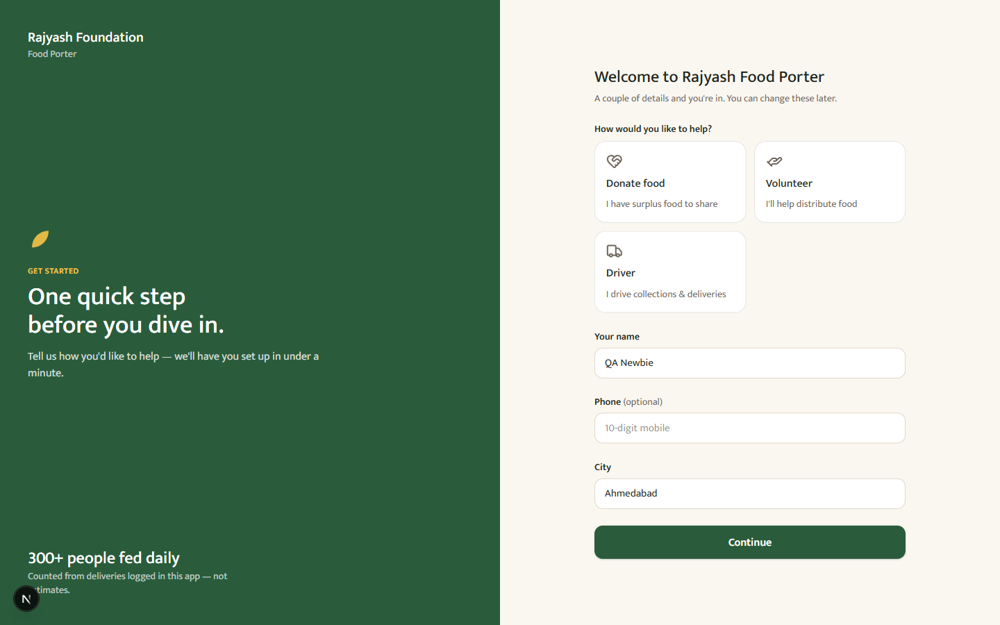

The very first time you sign in, you're asked one quick question before you see anything else:

1. **Pick a role** — three cards: **Donate food** ("I have surplus food to share"), **Volunteer**
   ("I'll help distribute food"), and **Driver** ("I drive collections & deliveries"). Tap one —
   it's not a dropdown. If you arrived via a specific link (e.g. the homepage's "Become a
   volunteer" button), the matching card may already be pre-selected.
2. **Complete your profile** — name (pre-filled from your account if available), phone
   *(optional)*, and city. One page, no sheet.

Submitting takes you straight to your home screen: `/portal/dashboard` for donor/volunteer,
`/portal/run` for driver.

> **Invited users never see this screen.** If the foundation invited you (any role — see
> **Invite a user** in the [admin guide](#users) below), your name, role, and city were set at
> invite time; your first sign-in provisions your profile automatically and lands you straight
> on your dashboard (admins on `/admin/dashboard`) — you never see the
> three role cards.

### The top bar (everywhere once signed in)

- **EN · ગુ · हि** — switch language (English, Gujarati, Hindi) any time. The choice is saved as
  a cookie and mirrored onto your profile, so notification copy follows it too.
- **Moon / Sun icon** — switch between light and dark themes, instantly, no page reload.
- **Your avatar (top-right)** — opens your account menu: manage account, sign out. This is
  Clerk's own modal, not a custom app screen.
- **Bell icon** — your notifications (see below).

These same three controls (language, theme, account menu) also exist for **anyone visiting the
public site**, before signing in — see [section 2](#2-the-public-website).

### Notifications

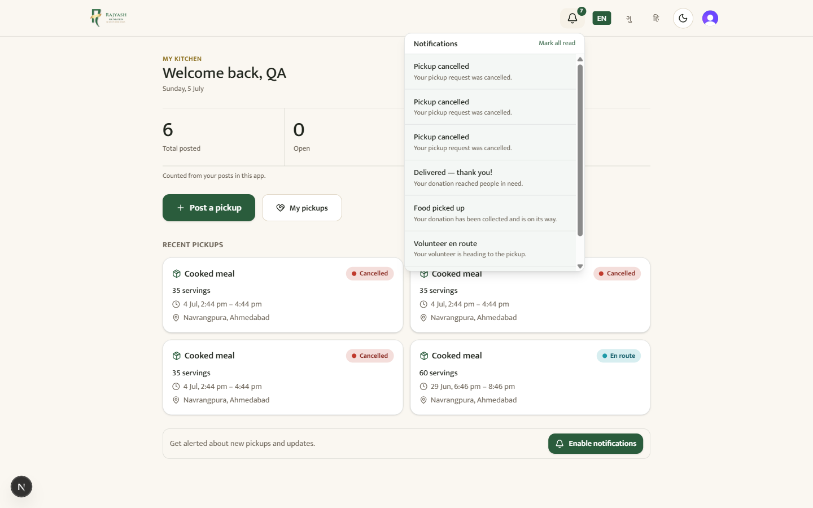

The app can tell you about new pickups and status changes in three ways:

- **The notification bell** (top bar, every signed-in page — portal and admin alike) — tap it to
  open the feed: your recent notifications, newest first, each with a timestamp. Tap an unread
  one to mark it read; **Mark all read** clears the badge in one tap. The small number badge on
  the bell shows your unread count (capped at "9+"). When you have nothing yet, the feed shows a
  simple empty state instead of a blank list.
- **Phone / browser push** (the main channel) — tap **Enable notifications** when the app offers
  the card, then choose **Allow** in your browser's permission prompt. This is what reaches your
  phone even when the app itself is closed. *If you never tap "Allow," you won't get push alerts
  — that's the usual reason someone "isn't getting notified."* The same opt-in card is shared by
  donor and volunteer dashboards; drivers land on **My Run** instead of the dashboard, so they
  don't currently see this card on that screen.
- **Email** (secondary) — receipts and some updates, once the foundation's email domain is fully
  set up.

---

## 2. The public website

Anyone can visit the site without signing in. This is the foundation's public face and the
donation entry point.

### Homepage

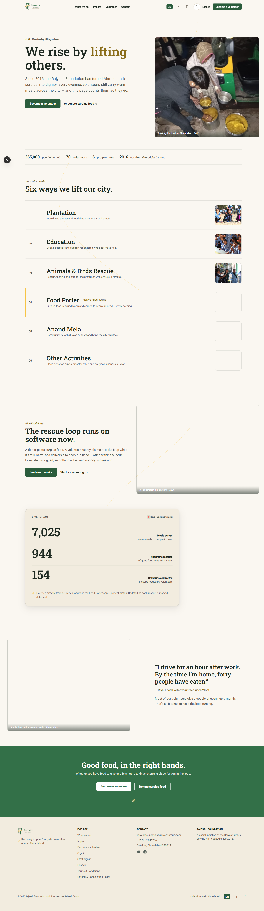

The homepage tells the foundation's story and counts its impact:

- **Hero** — the mission line and calls to action to **become a volunteer** or **donate surplus
  food**; the same button pattern also routes to donor/driver sign-up depending on where it's
  clicked from (nav vs. hero vs. the closing "finale" band).
- **Programme cards** — every foundation programme, each with its own image, so **What we do**
  isn't just text.
- **Copy that matches the real model** — "our driver will collect it, and volunteers help
  distribute it" language appears here, not "volunteers pick up."
- **Live impact panel** — meals rescued, kg rescued, deliveries, volunteers, and the year the
  work began, each pulled from real delivery records (not hand-typed) — the panel also shows
  where the numbers come from (provenance), the same honesty principle as the admin dashboard.
- **What we do / Impact / Volunteer / Contact** — anchor-scroll sections reached from the top
  nav, no page navigation.
- **Mobile menu** — on narrower screens, a hamburger icon opens a slide-over sheet with the nav
  links plus the language and theme controls and the sign-in/sign-up links, so small-screen
  visitors don't lose access to them.
- **Footer** — contact details, social links, and the legal pages.

### Signing in / creating an account

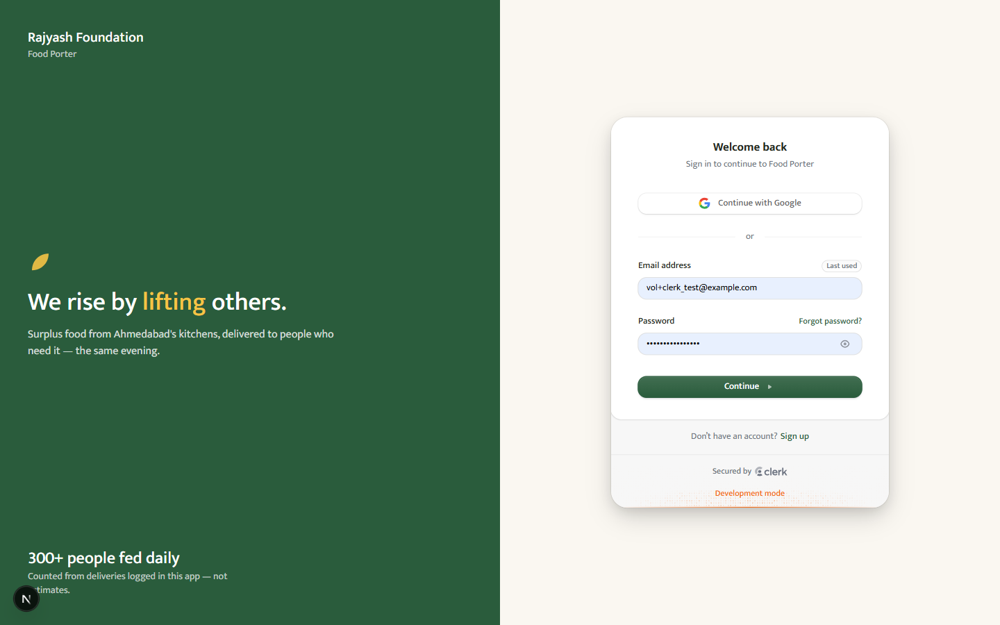


**Sign up** opens Clerk's own account-creation widget — enter an email, confirm the code sent to
it. **Sign in** is the same widget in reverse for a returning user. Neither page is a custom app
screen; both hand off to the account provider, then bring you back into onboarding (new users) or
straight to your dashboard (returning users).

### Staff sign-in

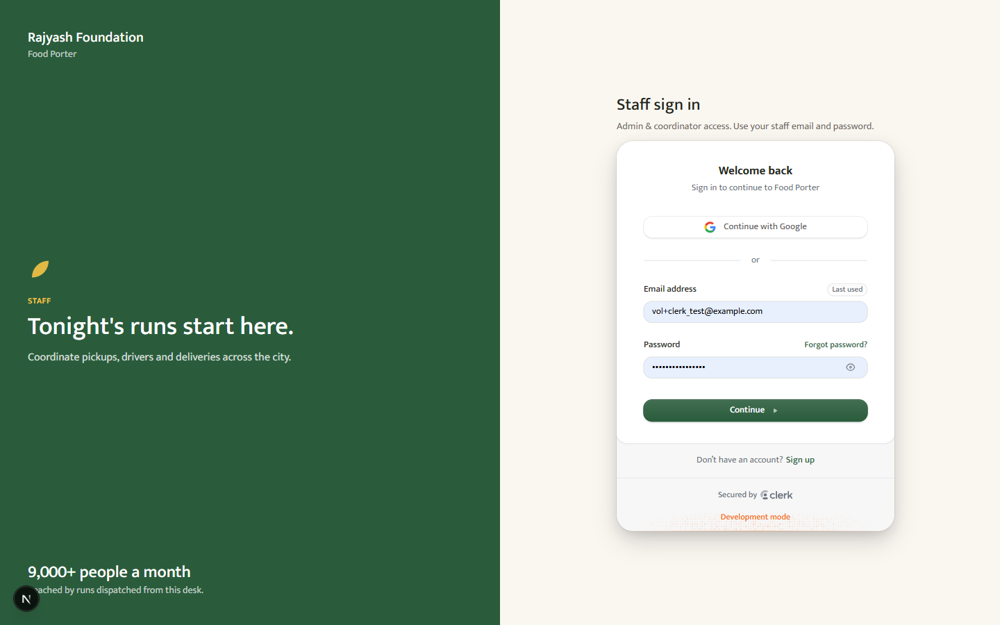

A distinct, staff-branded front door at `/staff` — same Clerk sign-in widget underneath, just
different copy and a different destination on success (`/admin/dashboard`). It exists so
coordinators have their own bookmark-able entry point; it does **not** grant admin access by
itself — your account's `role` is still checked on the server every time.

### Donate (money)

A **Donate** link in the header/footer — but only when the foundation has the payments feature
turned on (`PAYMENTS_ENABLED`). With it off, `/donate` redirects home and no Donate link renders
at all anywhere in the nav; this is a deliberate kill switch, not a bug, if you ever see it
missing.

When it's on: pick a preset amount or type a custom one, add your name and email *(optional, used
for the receipt)*, complete the Cloudflare Turnstile check, then confirm in the **Razorpay
Checkout** modal that opens. On success you see a "thank you — your receipt is on its way" screen
— it makes **no claim of success itself**; the payment is only ever confirmed by Razorpay's
server-side webhook, never by what the browser reports back. This protects the foundation from a
donor's browser lying about a payment that didn't actually go through.

### Legal pages

**Privacy**, **Terms & Conditions**, and **Refund & Cancellation Policy** are linked in the
footer and available in all three languages — read-only prose, required reading for anyone
paying online, and required by Razorpay for the account to process payments at all.

---

## 3. Donor guide

*You have surplus food — a restaurant tray, a wedding's extra thalis, a hostel's leftovers.
Here's how to get it to people who need it, in about a minute.*

### Your dashboard

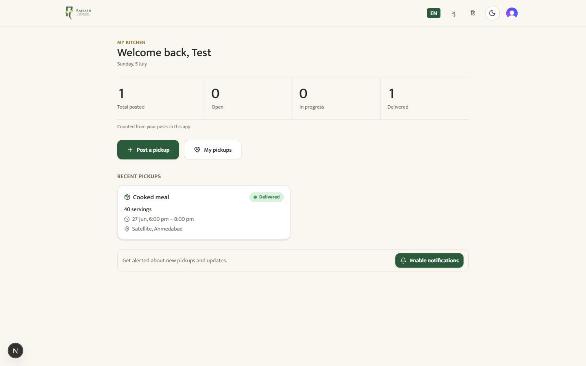

After signing in you land on **My Kitchen**. At a glance:

- **Total posted · Open · In progress · Delivered** — your running tally.
- **Post a pickup** — the big button; start here to share food.
- **My pickups** — a shortcut to everything you've posted.
- **Recent pickups** — your latest posts with their current status.
- **Enable notifications** — turn on push alerts so you know the moment your food is claimed and
  delivered (see [Notifications](#notifications) above).

### Posting a pickup

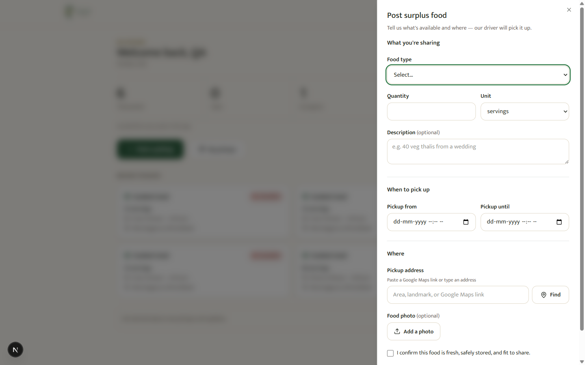

Tap **Post a pickup** (on the dashboard, or the **＋** on the My Pickups page) — a sheet slides in
from the right with the copy **"our driver will pick it up"**, so the model is clear from the
first screen. Fill the three sections:

**What**
1. **Food type** — cooked meal, bakery, packaged, raw produce…
2. **Quantity + Unit** — how much, in **servings** *or* **kg** (see [Meals vs. kg](#how-meals-and-kg-are-counted) — they're never converted into each other).
3. **Description** *(optional)* — a helpful note, e.g. "40 veg thalis from a wedding."

**When**
4. **Pickup window** — the **from** and **until** times your food is available to collect. Pick
   a realistic window; food safety depends on it.

**Where**
5. **Pickup address** — paste a **Google Maps link** or type an address/landmark, then tap
   **Find** — a spinner runs briefly, then a map appears below with a **draggable pin** you can
   fine-tune. Accurate location = a faster pickup.
6. **Food photo** *(optional)* — tap **Add photo**; the native file/camera picker opens, the
   image is compressed on your device, then uploaded with a progress indicator and a checkmark
   when done. Helpful for volunteers/drivers and nice for the foundation's records.
7. **Safety checkbox** — confirm the food is fresh, safely stored, and fit to share.
8. **Post pickup.**

That's it — your pickup joins the driver board for the foundation to collect.

> **Food-safety promise.** The confirmation checkbox is a real commitment: only post food that is
> fresh and safe to eat at pickup time.

### My pickups

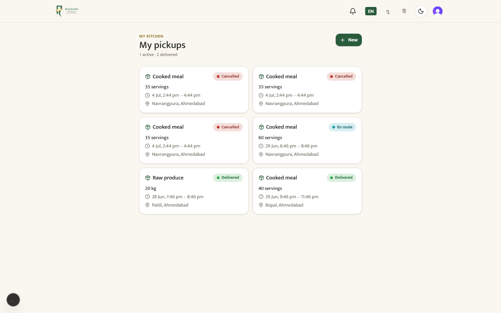

**My Pickups** lists everything you've posted, each card showing its current status. Open any
one for its full detail page and the actions below.

### Editing, cancelling, and reposting a pickup

On a pickup's detail page, your available actions depend on its status:

- **Edit** — shown **only while the pickup is still `Requested`** (nobody has collected it yet).
  Opens the same form as posting, in a sheet, pre-filled — closes and refreshes in place rather
  than navigating away.
- **Cancel** — also **`Requested`-only**, a destructive action set apart below a hairline.
  Confirms first ("are you sure?"). Cancelling also purges any GPS trail associated with the
  pickup, as a privacy side effect.
- **Repost** — available **at any status**, no confirmation needed. It fires immediately and
  takes you straight to the brand-new pickup it creates (same details, fresh `Requested` state)
  — handy for a donor who has the same surplus again tomorrow.

Once a pickup is claimed or assigned, it's in motion and can no longer be edited or cancelled —
only reposted.

### Tracking a pickup live

While your pickup's status is `En route` (the driver is on the way to collect it), the detail
page automatically swaps its static map for a **live tracking map** showing the driver's
position, updating every ~30 seconds.

> **Your live view ends once the food is collected.** This is deliberate, leg-aware tracking: you
> see the driver coming *to you*, but not the rest of their route once your food is in the
> vehicle and headed to a distribution point (see the [live-tracking table](#live-tracking-who-sees-what) in the appendix). The
> status text keeps updating (`Picked up` → `Delivered`) even after the map view ends.

### Status history (your receipt)

Scroll to the **History** section on a pickup's detail page for a plain timeline: every status
transition it has gone through, with a timestamp for each — this is the closest thing to a
receipt for the food itself, and it's generated automatically as the pickup moves through the
pipeline (nothing is ever hand-edited into it).

---

## 4. Volunteer guide

*You help get rescued food to people who need it — never by collecting it yourself. Here's your
side of the app.*

### Your dashboard

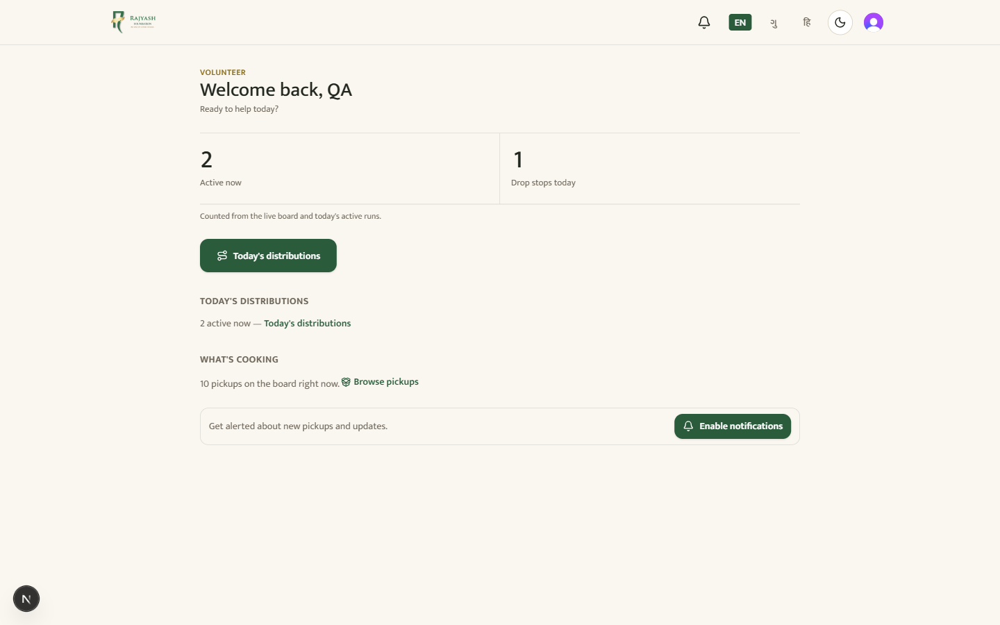

Signing in takes you to your portal home: ledger stats (open pickups, active runs) and shortcuts
to the board and today's distributions, plus your notification opt-in.

### Browsing the pickup board (read-only)

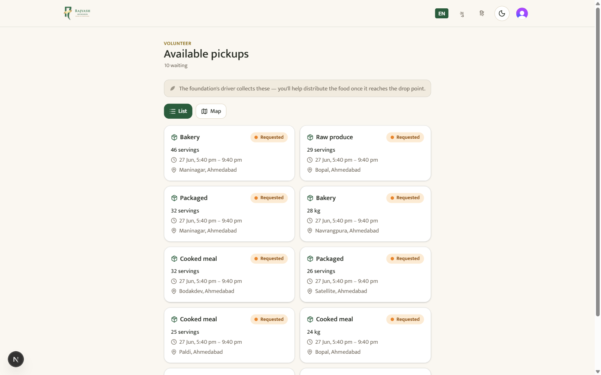

The **Board** shows every open (`Requested`) pickup waiting to be collected — the same board
drivers use, with **List** and **Map** tabs. As a volunteer you can see everything on it, but
**there is no claim button** — in its place, a quiet note explains that browsing is all this
screen is for. This is intentional, **not a bug or an oversight**: dispatch-model-v2 deliberately
removed the old volunteer claim button, because collecting is the driver's job now.

Tap a card to open a pickup's full detail page for awareness — you can view any active
(`En route` / `Picked up`) pickup even though you can't act on it.

### Today's Distributions

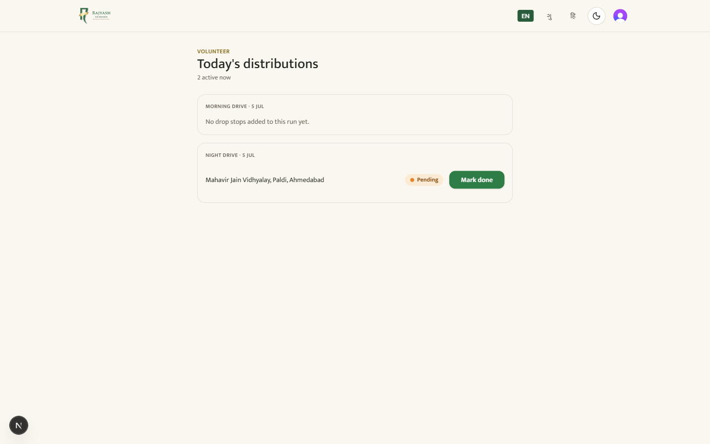

**Runs** (bottom nav) is your "join a run" surface — it lists every currently **active** run and,
for each, only its **drop stops** (the deliveries left to make). The pickup leg is deliberately
left off this screen; that part is the driver's job, not yours.

- **Mark done** — tap it on any stop row to confirm a drop is complete. This isn't restricted to
  one "assigned" volunteer — **any volunteer** can confirm a drop on an active run, since in
  practice whoever is physically present at the destination is the one who can see food actually
  handed over. A success toast confirms it; if that was the run's last stop, the toast copy calls
  that out too.

If no run is active right now, the page shows a plain empty state instead of an empty list.

### Enable push notifications

The same **Enable notifications** card that donors see, offered on your dashboard — see
[Notifications](#notifications) in section 1.

> **Tip:** because you're never claiming anything, there's no "leave it for someone else"
> decision to make on the board — just browse for awareness, and act from **Today's
> Distributions** when a run is actually active.

---

## 5. Driver guide

*You collect the food and run the delivery route. The app gives you a claim board, today's run,
and lets you tick off each stop.*

### The pickup board

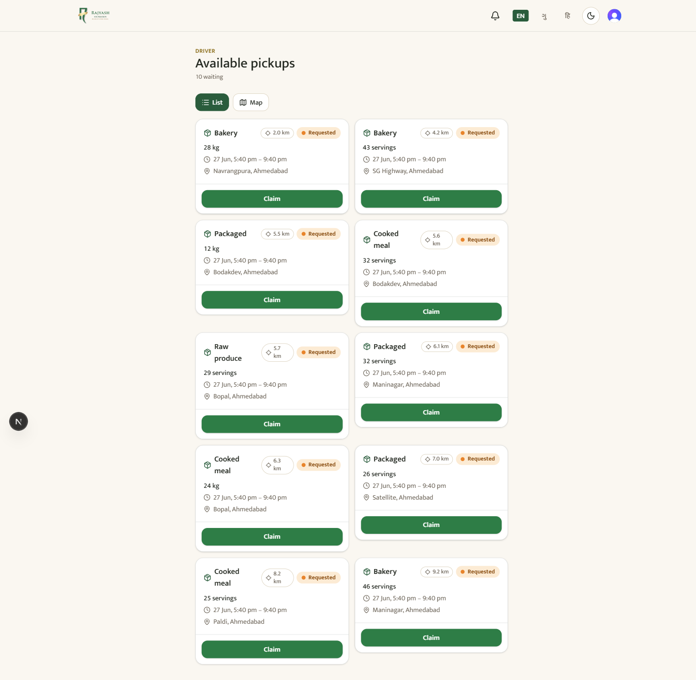

**Board** (bottom nav) is the same list/map view volunteers see, but as a driver you get the
claim control described below on every open pickup.

### Claiming a pickup

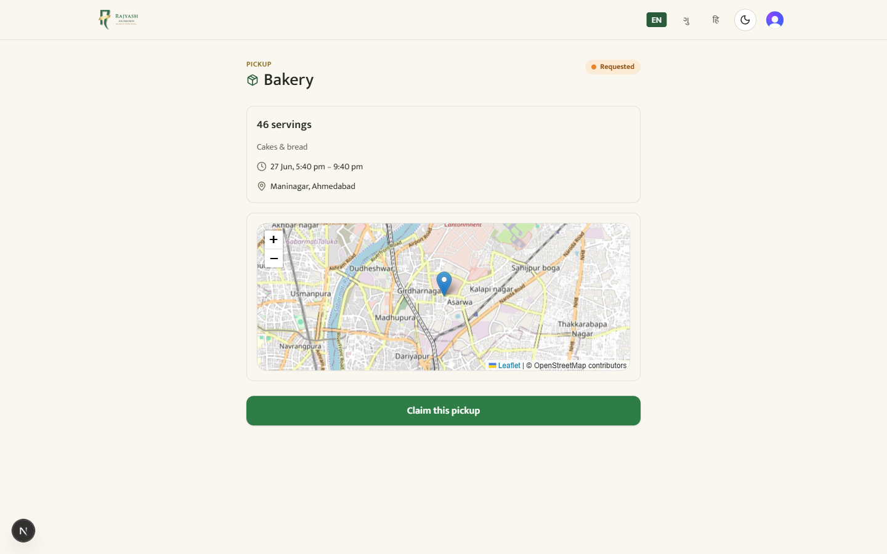

Open any `Requested` pickup from the board (or straight from its card) to reach its detail page,
where a large **Claim this pickup** button appears. Tapping it is atomic — if another driver
claimed it a moment earlier, you get a clear "already taken" error and the page refreshes to
reflect the real state, instead of two drivers both showing up for the same food.

Once claimed, the pickup is yours to run through its stages.

### Advancing a pickup's status

On the pickup detail page, an **"Advance to `<next status>`"** button walks the pickup forward
one stage at a time: `Accepted → En route → Picked up → Delivered`. Only you — the assigned
driver — see this button; once a pickup reaches a terminal state (`Delivered`/`Cancelled`) it
disappears, because there's nowhere further to advance.

**Uploading a proof-of-delivery photo** is offered right above the advance button, but **only on
the delivering step** (i.e. `Picked up → Delivered`), and it is **optional, not a gate** — you
can advance to `Delivered` without one. Distribution is confirmed by whoever is present, not by a
photo requirement.

### Navigating to a stop

A **Navigate** button (on the pickup detail page, or on **My Run**'s current-stop card) opens
Google Maps in a new tab with turn-by-turn directions already loaded — a free deep link, no
in-app map or dialog involved.

### Sharing your live location

There's no button for this — it starts automatically as soon as you land on a pickup detail page
while its status is `En route`/`Picked up`, or on **My Run** while the run is `Active`. A small
**"Sharing your location…"** banner (with a soft pulsing dot) confirms it's on, and reassures you
the trail is **deleted the moment you mark the pickup/stop delivered** — nothing lingers.

If your browser denies location access (or doesn't support it), a muted note explains sharing is
off and that the pickup still works normally either way — your driving isn't blocked by consent.

Behind the scenes this pings the server roughly every 30 seconds and stops itself automatically
once the server confirms the pickup/run is no longer active — you don't need to remember to turn
it off. *(On the web app, keep your screen on during the run for continuous tracking.)*

### My Run

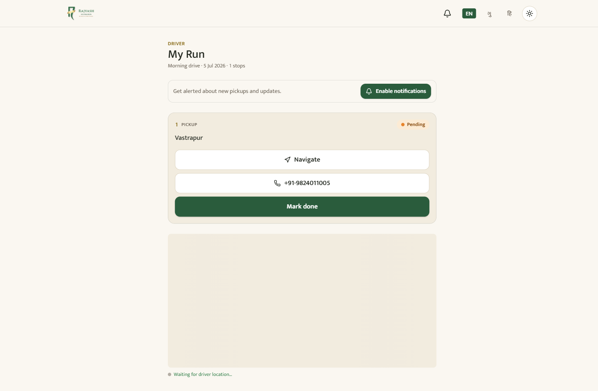

**My Run** (bottom nav) is your working checklist for the shift — the route a coordinator has
built or assigned you:

- **Run name/date and stops in order** — each stop is either a **Pickup** (collect food from a
  partner) or a **Drop** (deliver to a destination), with a **Pending** marker until you finish
  it.
- **Mark done** — tap it as you finish each stop. The run **auto-completes** once every stop is
  done, and your GPS trail is purged at that point.
- **Live map** — while the run is active, it shows your route toward the next stop (OSRM
  road-routing when available, otherwise a straight line and a rough ETA).
- Volunteers riding along with you can also confirm drops on the same run from their side.

*Before a run is assigned to you, this screen simply reads "No run assigned to you yet — check
back later," with the coordinator's phone number underneath.*

The structure of a run — its ordered pickup and drop stops — is exactly what staff build on the
admin side; see [Inside a run](#inside-a-run) in the admin guide for the full picture, including
how a coordinator can reassign you mid-run or override a stop if something needed correcting in
the field.

---

## 6. Admin / staff guide

*This is the coordinator's cockpit. Everything the foundation needs to run the operation lives
under **Staff sign-in → Admin**. This section is your training + support reference.*

The left sidebar is your map: **Overview · Pickups · Dispatch Runs · Destinations · Partners ·
Users · Reports**. Header buttons let you jump straight to **Log surplus** and **New run** from
several pages.

### Overview (dashboard)

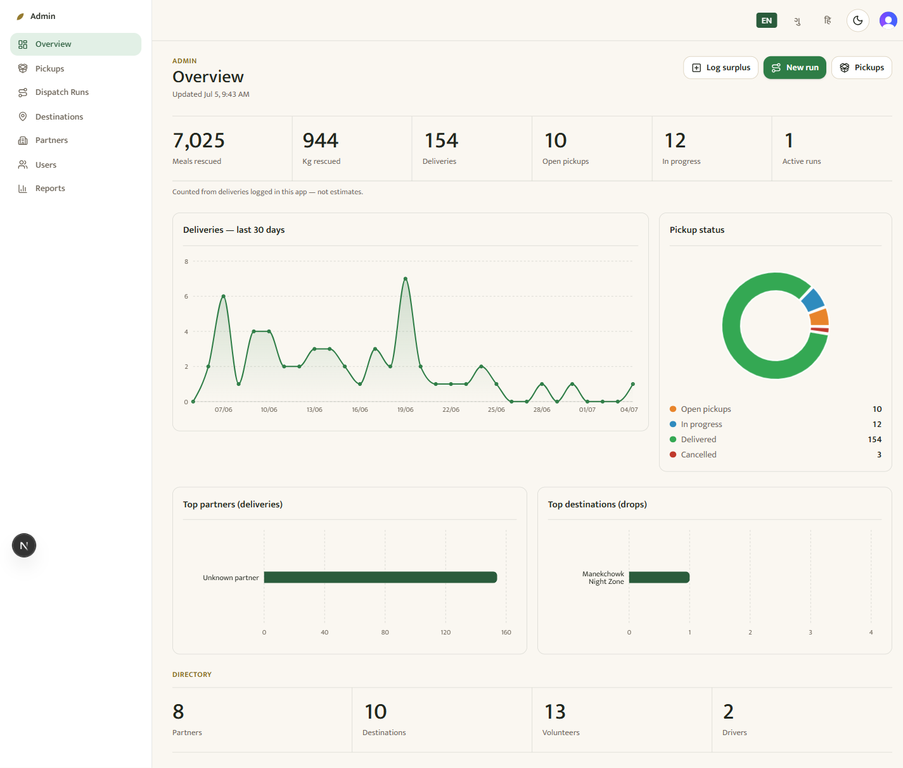

Your daily situational picture, all sourced from real records:

- **Top-line tiles** — meals rescued, kg rescued, deliveries, open pickups, in-progress count,
  active runs.
- **Deliveries — last 30 days** — the trend line.
- **Pickup status** — a donut of Open / In progress / Delivered / Cancelled.
- **Top partners** and **Top destinations** — where food comes from and where it goes.
- **Directory counts** — partners, destinations, volunteers, drivers.

#### How meals and kg are counted

A small **"?"** hint sits next to each of these two tiles, because they are genuinely two
separate things and the app is deliberate about **never converting one into the other**:

- **Meals rescued** — delivered pickups logged in **servings**; one serving = one meal.
- **Kg rescued** — delivered pickups logged by **weight**, counted completely separately.

A pickup is logged in whichever unit the donor (or the staff member logging on their behalf)
chose — never both, and never converted. If you're explaining the dashboard to a partner or a
CSR sponsor, this is the one number that needs the caveat.

**Use the Overview to:** spot a pile-up of *Open* pickups that need dispatching, or *In progress*
items that look stalled.

### Pickups

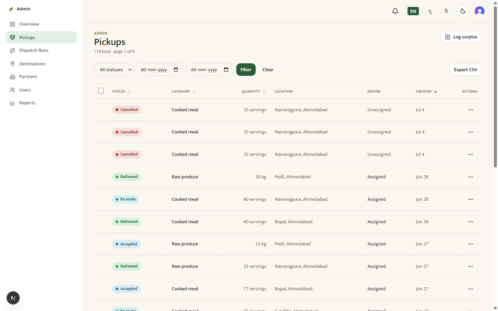

Every pickup in the system — the master list behind the whole rescue loop.

- **Filter and sort** — a filter bar (status, date range) plus a sortable table; click a column
  header to sort by it, click again to reverse; any sort/filter change resets you to page 1.
- **Assign a pickup to a driver** — row **⋯** menu → **Assign**, shown only on `Requested` rows.
  Opens a dialog with a driver picker. This is the manual, admin-only path for putting a specific
  person on a pickup instead of letting drivers claim from the board — the picker is scoped to
  drivers only (a pickup assigned to a volunteer here would get stuck, since only the assigned
  *driver* role can later advance it).
- **View a pickup** — row **⋯** menu → **View**, or click the row — opens the same detail page
  everyone uses, with an admin-only **Verify / Unverify** toggle (a bookkeeping flag; it never
  blocks the pickup from moving through its normal stages).
- **Export CSV** — the **Export** link in the filter bar downloads the currently filtered/sorted
  list as a file; no in-app dialog.

**What to do when:**
- *A pickup sits Open too long* → assign it, or leave it — a nightly job auto-cancels stale
  entries whose window has lapsed, and separately flags stale *claimed* ones for follow-up.
- *You need a specific person on a pickup* → open it and assign a driver.

### Dispatch Runs

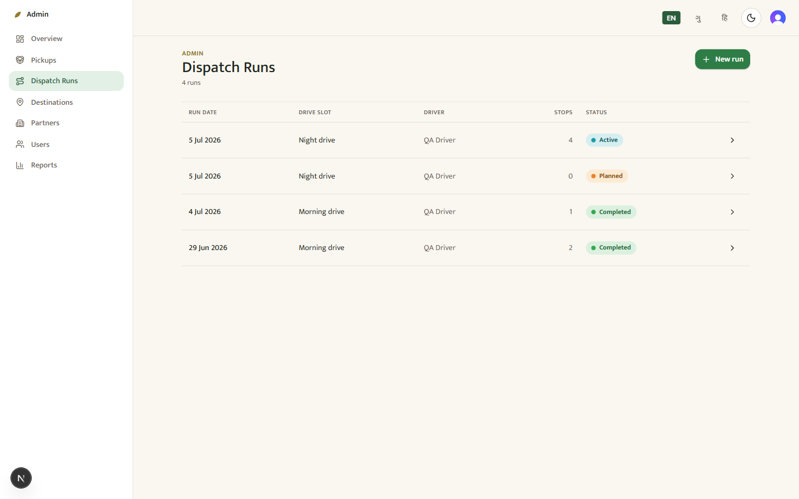

A **run** is a driver's route for one trip: a set of pickup stops (collect) and drop stops
(deliver). This screen lists every run with its date, slot, status, and driver.

#### Creating a new run

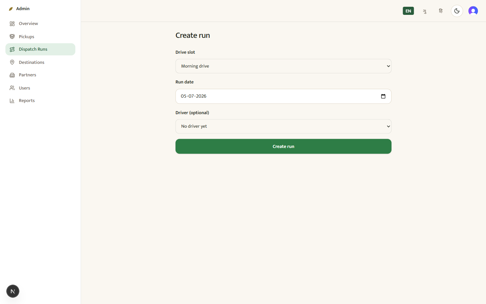

**New run** (header button, from Overview or the Runs page) opens a sheet: choose the **slot**
(morning/night) and **date**, and optionally pick a **driver** right away — you can also leave
the driver unassigned and set it later. Stops aren't added here; on success you land on the new
run's detail page, where you add them (see below).

#### Inside a run

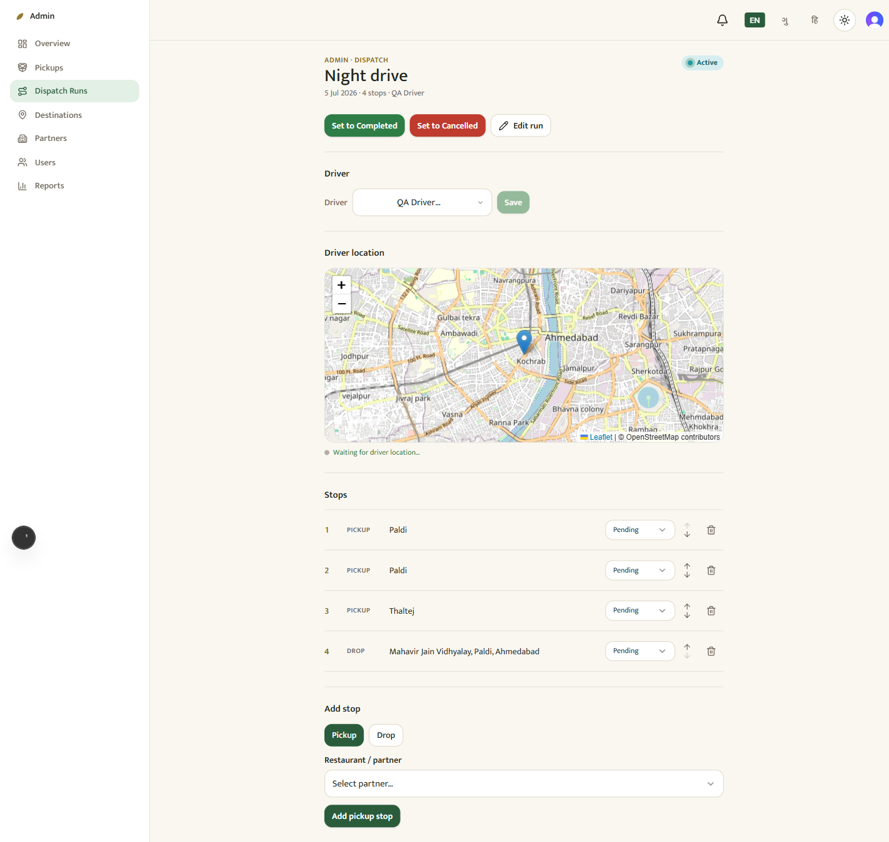

The run detail page is the live control surface for one route:

- **Advance / cancel the run** — status buttons for the legal next transitions only (`Planned →
  Active → Completed`, or `→ Cancelled` from either). Forward transitions apply immediately;
  **Cancel** (and **Delete**) go through a confirm dialog first.
- **Delete a run** — only offered while the run is `Planned` or `Cancelled` (never once it's
  active or completed); confirms first.
- **Edit run** — an **Edit run** button opens a sheet to change the run's **slot** and **date**
  (its driver is changed separately, below — editing the run itself leaves the driver
  untouched). See [Edit-run sheet](#edit-run-sheet) below.
- **Assign / reassign the run's driver** — a dedicated driver picker + **Save**, shown while the
  run is still editable (`Planned`/`Active`). This is how you change the driver on a run **after
  it already exists** — separate from picking one at creation time, and separate from the
  edit-run sheet.
- **Live map** — appears automatically once the run is `Active`, showing the driver's real-time
  position and route toward the next stop.
- **Stops list, in order** — each row shows its sequence number, **Pickup**/**Drop** kind, and
  address:
  - **Reorder** — up/down arrow icons swap a stop with its neighbour immediately (no dialog).
  - **Override a stop's status** — an admin-only dropdown lets you set a stop's status directly
    (`Pending`/`Done`/`Skipped`) — a deliberate escape hatch for correcting a missed "mark done"
    in the field, bypassing the normal driver/volunteer confirm flow. Non-admins never see this
    control; they only see a plain status pill.
  - **Remove a stop** — trash icon, confirms first.
  - All stop editing (add/reorder/override/remove) is only available while the run is `Planned`
    or `Active` — a completed or cancelled run's stop list is permanently read-only.
- **Add a stop** — at the bottom, a **Pickup / Drop** toggle:
  - *Pickup* → pick a **partner** from a dropdown, then **Add pickup stop**.
  - *Drop* → a **Saved / Ad-hoc** toggle: pick a saved **destination**, or type a free-text
    address that gets **geocoded automatically** on submit.

##### Edit-run sheet

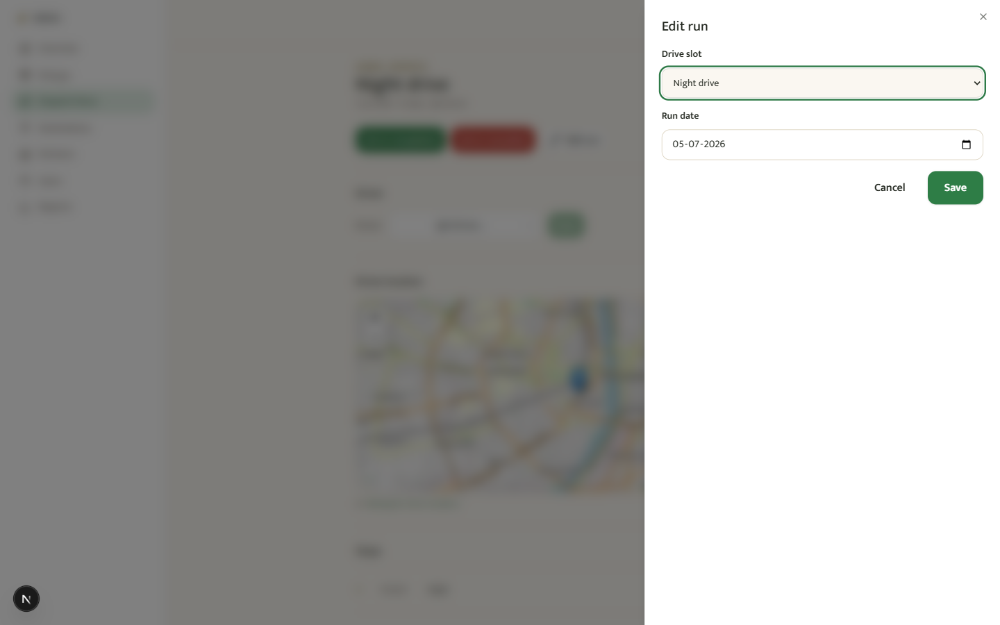

A short sheet with just **slot** and **date** — intentionally narrow. Reassigning the driver
lives in its own control on the run detail page (above) rather than in this form, so the two
concerns don't get tangled together.

### Destinations

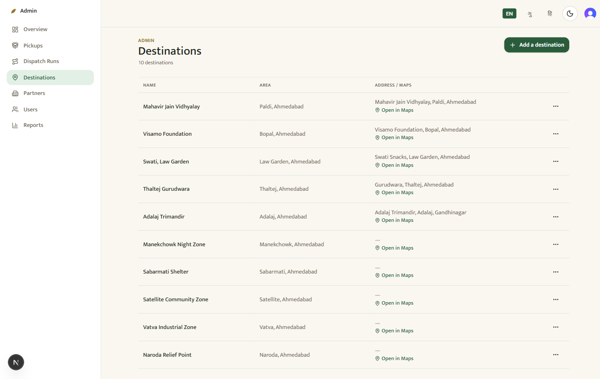

The places rescued food is delivered to — shelters, night zones, community points. Each row has
an **Open in maps** link. They become the **drop stops** you choose when building a run.

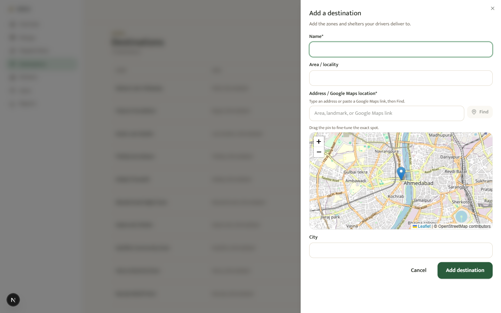

- **Add a destination** — a sheet with name, area, an **address field + Find** button (paste a
  Google Maps link or type an address, drop a pin), a draggable pin on an embedded map, and city.
- **Edit a destination** — the same sheet, pre-filled, from the row's **⋯** menu.
- **Delete a destination** — confirms first; if the destination was used by a past run, the
  delete is **blocked** with a conflict message instead of silently failing.

> **Known limitation.** The delete-conflict message suggests marking the destination *inactive*
> instead of deleting it — but as of this handbook, **no toggle for that exists anywhere in the
> UI** (the add/edit form has no active/inactive control; a destination is always active once
> created). Practically: if a destination shouldn't be offered for new runs anymore, the only
> current workaround is simply never selecting it when adding a drop stop — there's no way to
> hide it from the picker without deleting it (which the conflict guard may block). Worth a
> follow-up fix; not something to hunt for in the UI.

### Partners

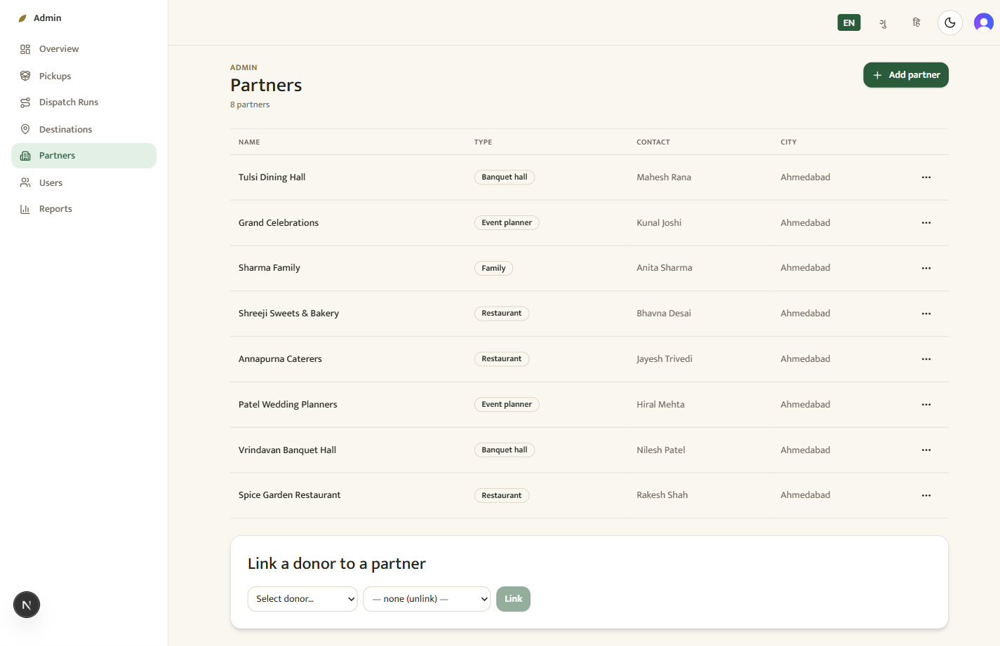

The restaurants, hostels, and organisations that regularly donate.

- **Add / Edit a partner** — a sheet (name, type, etc.); edit reuses the same form, pre-filled.
- **Delete a partner** — confirms first; blocked with a conflict message if the partner is linked
  to donors or has past run stops.
- **Link a donor to a partner** — a separate card below the partners table: two plain HTML
  `<select>` dropdowns (donor, then partner) and a **Link** button — visually plainer than the
  rest of the page, but functionally the same idea: it lets the foundation **attribute rescued
  food to that partner** in reports, even though the donor posted it under their own account.

### Users

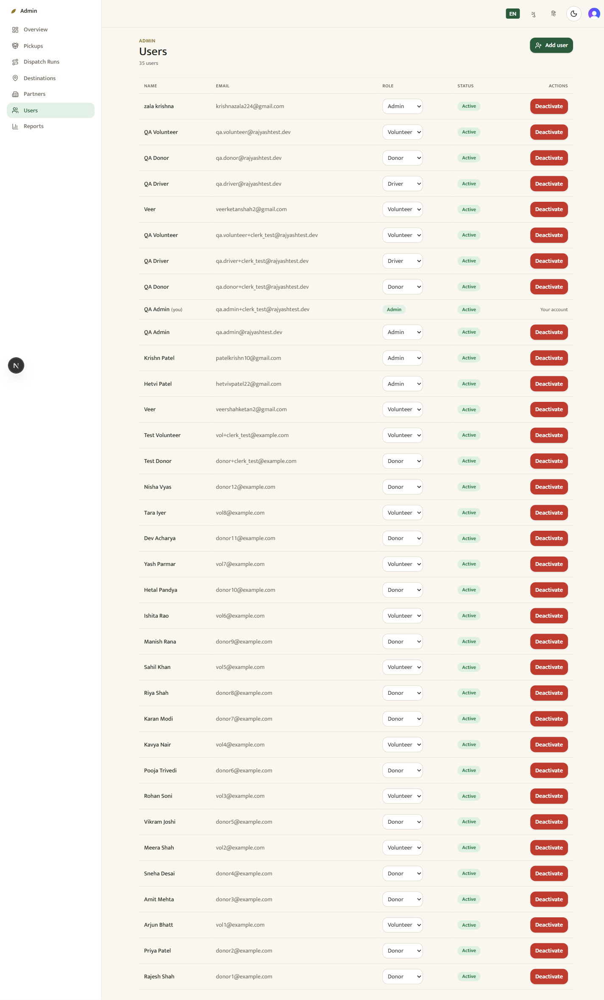

Everyone in the system: name, email, role, status, actions.

- **Change a user's role** — the row's role dropdown (a plain native `<select>`, not the styled
  one) **fires immediately on change — there's no confirm dialog.** Your own row shows a static
  badge instead of a dropdown (you can't change your own role), and the server independently
  blocks any change that would demote the platform's **last active admin**.
- **Invite a user** — the **Invite** button opens a modal: **email, the person's name** (required),
  a role dropdown offering **all four roles** (donor / volunteer / driver / admin — admin can
  *only* be assigned here, never self-selected), and optional **phone** and **city**. Selecting
  **Admin** shows a small hint note right there in the form, because this is **the way you make
  someone an admin** — there's no separate "promote to admin" control. On send, the person gets
  an email invite; when they sign in through it they **skip onboarding entirely** — their profile
  (name, role, phone, city) is provisioned automatically from what you entered, and they land
  straight on their dashboard (admins on `/admin/dashboard`). On success the modal shows an
  inline **"invite sent"** confirmation (not a toast), so you can immediately invite another
  person without losing context.

  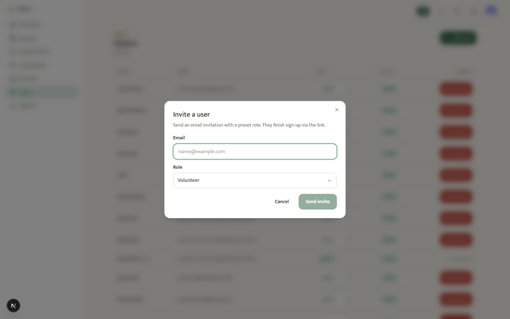

- **Deactivate a user** — a destructive button, confirms first. Blocked if it would deactivate
  the last active admin, or if you try it on your own account.
- **Reactivate a user** — shown only on already-deactivated rows, **fires immediately with no
  confirm dialog** — asymmetric with Deactivate on purpose, since reactivating is the safer
  direction.

### Reports

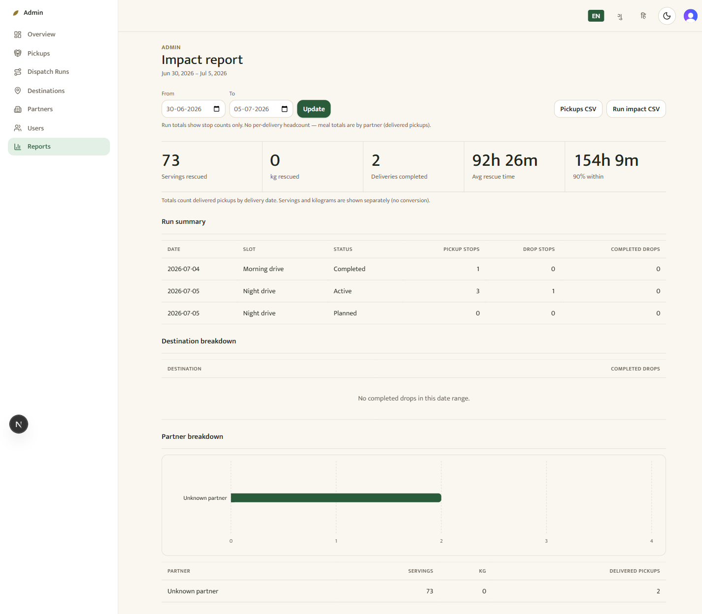

The numbers the foundation, donors, and auditors ask for, over any date range:

- **Meals / kg rescued and deliveries** for the period — the same never-converted split as the
  Overview dashboard (see [How meals and kg are counted](#how-meals-and-kg-are-counted)).
- **Average and 90%-within rescue time** (posted → delivered) — the headline food-safety and
  impact metric.
- **Breakdowns** by run, by destination, and by partner, each with a small bar chart.
- **Date range** — inline date inputs on the report widget; changing them re-runs everything via
  the URL (so a link to a specific range is shareable). Defaults to month-to-date.
- **Export runs CSV** — a link on the Reports page, carrying the current date range.
- **Export pickups CSV** — also linked from the Reports page (the same export the Pickups page's
  own **Export** button produces), carrying whatever filters were active.

### Log surplus

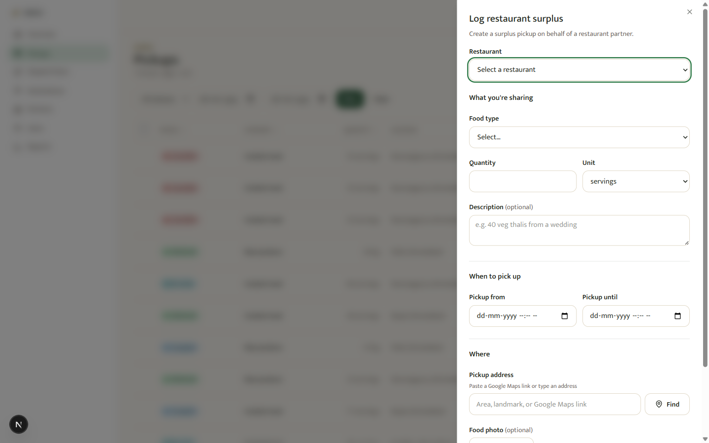

**Log surplus** (header button, from Overview or the Pickups page) opens a sheet for staff to
record a pickup **on a partner's behalf** — for food that came in by phone call or in person
rather than through the partner posting it themselves. Pick the partner first, then fill the same
food form a donor would (food type, quantity/unit, description, window, address). The resulting
pickup is tagged as **logged by a coordinator** so it's distinguishable in reports, and submitting
navigates you to the Pickups list with the sheet closed.

---

## 7. Appendix

### The rescue loop (corrected model)

```
Donor posts food  →  Staff dispatch it into a run  →  Driver claims/is assigned it, collects (pickup leg)
      →  Driver + volunteers deliver to a destination (distribution leg)  →  Delivered ✓
```

- A **driver** collects — by claiming an open pickup from the board, or by being assigned into a
  run by staff. Volunteers are never the collector.
- A **volunteer** rides along or meets the run at the drop to help distribute and can confirm
  the drop; they browse pickups and runs for awareness but don't act on the pickup leg.
- **Staff** build runs, adjust them live (reorder/add/remove/override stops, reassign the
  driver), and can manually assign a specific driver to a pickup outside the normal claim flow.

Every step is recorded — who did it and when — via an audited status-event trail. Nothing is
marked delivered without going through the proper stages.

### Live tracking — who sees what

The driver's GPS is the tracked position; visibility depends on which **leg** the pickup is on
and who's watching:

| Leg | Pickup status | Admin | Donor (owner) | Volunteer |
|-----|---------------|:-----:|:--------------:|:---------:|
| Pickup (→ collect) | `En route` | ✅ | ✅ | ✅ |
| Distribution (→ drop) | `Picked up` | ✅ | ❌ — the donor's live view ends here | ✅ |

The donor's status text keeps updating after their live view ends (`Picked up` → `Delivered`);
they simply stop seeing the moving pin once their food has been collected. Any active volunteer
can view a driver's location on both legs — in this single-organisation app that's treated as
acceptable; a future refinement could scope it to "volunteers on this specific run" only.

### Pickup statuses

| Status | Meaning |
|--------|---------|
| **Requested** | Posted, waiting to be collected (donor can still edit/cancel) |
| **Accepted** | Claimed or assigned to a driver — someone is on it |
| **En route** | Driver on the way to collect |
| **Picked up** | Food collected, heading to the destination |
| **Delivered** | Reached people in need — done |
| **Cancelled** | Called off, or auto-cancelled after its pickup window lapsed |

### Run statuses

| Status | Meaning |
|--------|---------|
| **Planned** | Built, not yet started — stops can be freely added/reordered/removed |
| **Active** | Underway — live map on, stops still editable, driver reassignable |
| **Completed** | Every stop marked done (auto) — read-only from here on |
| **Cancelled** | Called off by staff — read-only |

### Run stop statuses

| Status | Meaning |
|--------|---------|
| **Pending** | Not yet done |
| **Done** | Confirmed — by a driver (pickup stop), a volunteer (drop stop), or an admin override |
| **Skipped** | Deliberately bypassed (set via the admin override control) |

### Languages & accessibility

The entire app works in **English, Gujarati, and Hindi**, in **light and dark** themes, and
installs on any phone as an app (no app store needed) — tap your browser's "Add to Home Screen."
All screenshots in this handbook show the English interface; the same layouts appear in every
language.

### Support

Questions about the platform or a specific rescue:
**rajyashfoundation@rajyashgroup.com · +91-9875041206 · Satellite, Ahmedabad 380015**

---

*This handbook reflects the live application, including the notification bell, run-driver
reassignment, run editing, and per-stop status override that closed earlier gaps in the admin
tooling. Screens are shown in English; the same screens appear in Gujarati and Hindi when you
switch language.*
