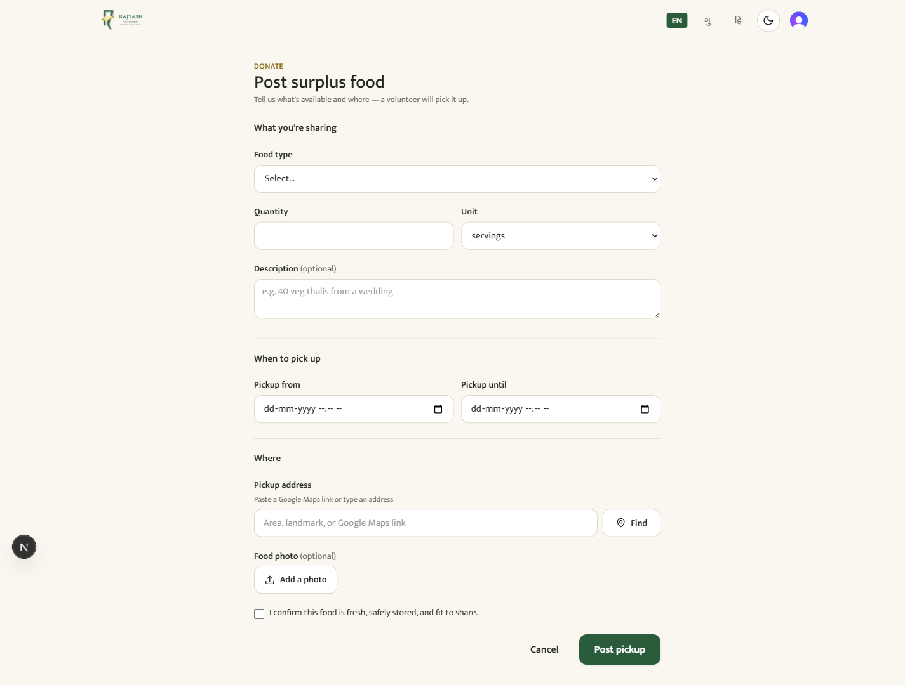
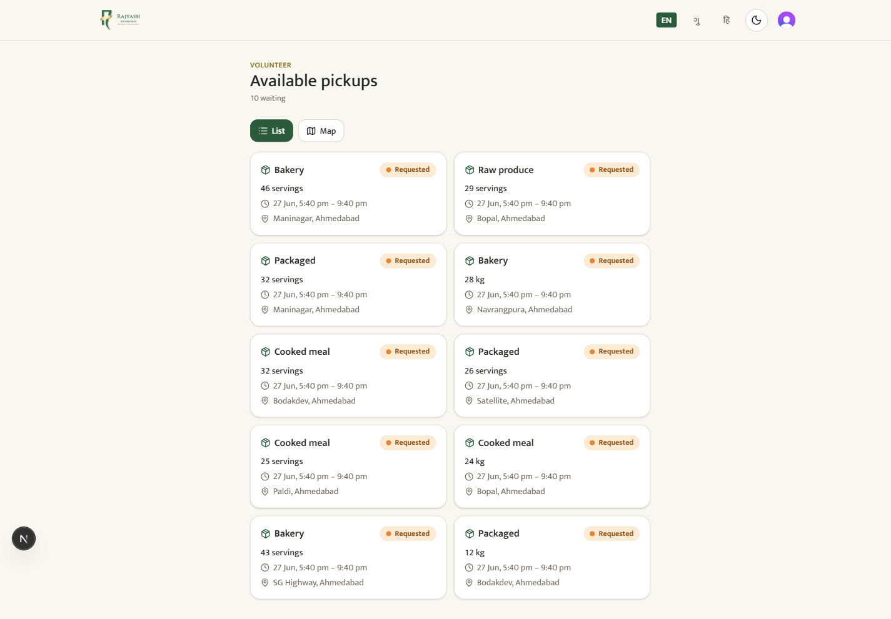

# Food Porter — Complete User Handbook

*The Rajyash Foundation food-rescue platform · screen-by-screen guide for every user*

This handbook covers the whole web app, screen by screen, for everyone who uses it:
**donors** who share surplus food, **volunteers** who help distribute it, **drivers** who
collect and run deliveries, and **foundation staff (admins)** who coordinate everything. It
doubles as the **training and support reference** for the foundation team — each section is
written for the person who uses it, and the admin section goes deep enough to train and support
others.

> **How the rescue works (the real-world model).** A donor posts surplus food. The foundation's
> **driver collects it**, and **volunteers ride along as helping hands to distribute** it to
> people in need. Staff coordinate pickups into delivery **runs** and watch everything live on
> one dashboard.

---

## Contents

1. [For everyone — signing in, language, theme, notifications](#1-for-everyone)
2. [The public website (homepage & visitors)](#2-the-public-website)
3. [Donor guide](#3-donor-guide)
4. [Volunteer guide](#4-volunteer-guide)
5. [Driver guide](#5-driver-guide)
6. [Admin / staff guide](#6-admin--staff-guide)
7. [Appendix — statuses, the loop, support](#7-appendix)

---

## 1. For everyone

### The four roles

| Role | Who they are | What they do in the app |
|------|--------------|--------------------------|
| **Donor** | A restaurant, hostel, family, or event host with surplus food | Posts food for pickup; tracks it to delivery |
| **Volunteer** | A helper who assists with distribution | Sees available pickups; helps deliver alongside the driver |
| **Driver** | The foundation's (paid) driver | Runs the assigned collection + delivery route |
| **Admin (staff)** | Foundation coordinators | Coordinate pickups, build delivery runs, manage people & places, read reports |

Your role is set once, when you first sign in (see onboarding below). Admins are appointed by
the foundation — you can't pick "admin" yourself.

### Signing in

- **Donors, volunteers, drivers:** open the site and choose **Sign in** (top-right) or **Become
  a volunteer**. You sign in with your email — enter the code we send you. No password to
  remember.
- **Foundation staff:** use the **Staff sign-in** page (linked in the footer, or go to `/staff`).

### The top bar (everywhere once signed in)

- **EN · ગુ · हि** — switch language (English, Gujarati, Hindi) any time. The whole app,
  including the words in this handbook's screenshots, follows your choice.
- **Moon/Sun** — switch between light and dark themes.
- **Your avatar** — account menu and sign-out.

### Notifications

The app can alert you about new pickups and status changes two ways:

- **Phone/browser push** (the main channel) — tap **Enable notifications** when the app offers,
  and choose **Allow** in your browser. This is what lets alerts reach your phone even when the
  app is closed. *If you never tap "allow," you won't get push alerts — that's the usual reason
  someone "isn't getting notified."*
- **Email** (secondary) — receipts and some updates. *(Email only starts arriving once the
  foundation finishes domain setup at launch.)*

---

## 2. The public website

Anyone can visit the site without signing in. This is the foundation's public face and the
donation entry point.

### Homepage


The homepage tells the foundation's story and counts its impact:

- **Hero** — "We rise by lifting others," the mission line, and two calls to action:
  **Become a volunteer** and **donate surplus food**.
- **Live impact stats** — people helped, volunteers, programmes, and the year the work began.
- **What we do / Impact / Volunteer / Contact** — scroll sections reached from the top nav.
- **Footer** — contact details, social links, and the legal pages (Privacy, Terms, Refund &
  Cancellation Policy).

**For staff:** the numbers on the homepage are pulled from real delivery records — they are not
hand-typed, so they stay honest as the work grows.

### Signing in / creating an account


New users tap **Become a volunteer** or **Sign in → Create account**, enter an email, and
confirm the emailed code. First-time users are then asked one quick question — *how do you want
to help?* — which sets their role (donor, volunteer, or driver).

### Staff sign-in


Foundation coordinators sign in here. Admin access is granted by the foundation, not chosen at
sign-up.

### Legal pages

**Privacy**, **Terms & Conditions**, and **Refund & Cancellation Policy** are linked in the
footer and available in all three languages. The refund policy is required for online donations
and explains how erroneous or duplicate payments are handled.

---

## 3. Donor guide

*You have surplus food — a restaurant tray, a wedding's extra thalis, a hostel's leftovers.
Here's how to get it to people who need it, in about a minute.*

### Your dashboard


After signing in you land on **My Kitchen**. At a glance:

- **Total posted · Open · In progress · Delivered** — your running tally.
- **Post a pickup** — the big green button; start here to share food.
- **My pickups** — everything you've posted.
- **Recent pickups** — your latest posts with their current status (e.g. *Delivered*).
- **Enable notifications** — turn on alerts so you know when your food is claimed and delivered.

### Posting a pickup — step by step



Tap **Post a pickup** and fill the short form:

1. **Food type** — choose the category (cooked meal, bakery, packaged, raw produce…).
2. **Quantity + Unit** — how much, in *servings* or *kg*.
3. **Description** *(optional)* — a helpful note, e.g. "40 veg thalis from a wedding."
4. **When to pick up** — the **from** and **until** times your food is available. Pick a
   realistic window; food safety depends on it.
5. **Pickup address** — paste a **Google Maps link** or type an area/landmark, then tap
   **Find** to drop the pin. Accurate location = faster pickup.
6. **Food photo** *(optional)* — a quick picture helps and is nice for the foundation's records.
7. **Confirm** the food is fresh, safely stored, and fit to share — then **Post pickup**.

That's it. Your pickup joins the board for the foundation to collect.

> **Food-safety promise.** The confirmation checkbox is a real commitment: only post food that
> is fresh and safe to eat at pickup time.

### My pickups & tracking


**My pickups** lists everything you've posted with its status. Open any pickup to see its
details and, once it's on the way, **track it live on a map** from pickup to delivery. When it's
delivered, the status turns to **Delivered** — your food reached someone.

**You can edit or cancel** a pickup only while it's still *Requested* (nobody has collected it
yet). Once it's claimed, it's in motion.

---

## 4. Volunteer guide

*You help get rescued food to people who need it. Here's your side of the app.*

### Your dashboard


Signing in takes you to your portal home, with a shortcut to the **pickup board** and your
notifications toggle.

### The pickup board



**Available pickups** shows everything waiting to be collected — a card per pickup with the food
type, quantity, time window, and area. A counter up top shows how many are **waiting**.

- **List / Map** — switch between the card list and a map view to see what's near you.
- Each card shows a **Requested** pill until it's collected.

### A pickup up close


Tap a card to open it: the full details, the location on a live map, and — when you're helping
collect it — **Claim this pickup**. Claiming assigns it so two people never turn up for the same
food.

**Once a pickup is active,** its progress moves through the stages *accepted → en route → picked
up → delivered*, and the donor can watch it live on the map. Volunteers ride with the driver to
help hand out the food at the destination and confirm the drop.

> **Tip:** if you tapped a pickup but can't collect it after all, don't claim it — leave it for
> someone who can.

---

## 5. Driver guide

*You collect the food and run the delivery route. The app gives you today's run and lets you
tick off each stop.*

### My Run


**My Run** shows the route a coordinator has assigned you. When you have no run yet, you'll see
*"No run assigned to you yet — check back later,"* with the coordinator's phone number if you
have questions.

**When a run is assigned,** this screen becomes your working checklist for the shift:

- **Your stops in order** — each pickup to collect and each destination to drop at.
- **Mark each stop done** as you complete it. The run auto-completes when every stop is finished.
- **Live location** — while your run is active, the app shares your location so coordinators and
  donors can see progress on the map. *(On the web app, keep your screen on during the run for
  continuous tracking.)*
- Volunteers riding with you can also confirm drops on an active run.

The structure of a run (its ordered pickup and drop stops) is the same one staff build on the
admin side — see the **run detail** screen in the admin guide for the full picture.

---

## 6. Admin / staff guide

*This is the coordinator's cockpit. Everything the foundation needs to run the operation lives
under **Staff sign-in → Admin**. This section is your training + support reference.*

The left sidebar is your map: **Overview · Pickups · Dispatch Runs · Destinations · Partners ·
Users · Reports**. Header buttons let you jump to **Log surplus**, **New run**, and **Pickups**.

### Overview (dashboard)


Your daily situational picture, all from real records:

- **Top-line tiles** — meals rescued, kg rescued, deliveries, open pickups, in-progress, active
  runs.
- **Deliveries — last 30 days** — the trend line.
- **Pickup status** — a donut of Open / In progress / Delivered / Cancelled.
- **Top partners** and **Top destinations** — where food comes from and goes to.
- **Directory counts** — partners, destinations, volunteers, drivers.

**Use it to:** spot a pile-up of *Open pickups* (need dispatching) or *In progress* items that
have stalled.

### Pickups


Every pickup in the system, filterable and sortable. From here staff can **assign a pickup to a
volunteer/driver**, follow its status, and open any record. This is the master list behind the
whole rescue loop.

**What to do when:**
- *A pickup sits Open too long* → assign it, or it will be auto-cancelled after its window
  lapses (the nightly clean-up handles dead entries and logs stale claimed ones for you).
- *You need to hand a pickup to a specific person* → open it and assign the volunteer/driver.

### Dispatch Runs


A **run** is a driver's route — a set of pickup and drop stops done in one trip. This screen
lists all runs with their date, slot, status, and driver.

#### Building a new run


**New run** creates the route: pick the date and time slot, assign a **driver**, and add the
**pickup stops** (food to collect) and **drop stops** (destinations to deliver to). Assigning a
driver notifies them.

#### Inside a run


The run detail screen is the live control for one route: its **ordered stops**, each stop's
status, the ability to **reorder, add, or remove stops**, override a stop's status, and follow
the driver's progress. This is exactly what the driver sees as their checklist.

### Destinations


The places rescued food is delivered to — shelters, night zones, community points. Add and
manage them here; they become the **drop stops** you choose when building runs.

### Partners


The restaurants, hostels, and organisations that regularly donate. Linking a donor to a partner
lets the foundation **attribute rescued food to that partner** in reports.

### Users


Everyone in the system. From here staff can **change a user's role**, **invite a new user by
email with a preset role**, and **deactivate** someone. (Safeguards prevent removing the last
admin.)

**What to do when:**
- *Onboard a new coordinator* → invite by email with the admin role; they land in the admin area
  after signing up.
- *Someone should no longer have access* → deactivate them (takes effect immediately).

### Reports


The numbers the foundation, donors, and auditors ask for — over any date range:

- **Meals / kg rescued and deliveries** for the period.
- **Average and 90%-within rescue time** (posted → delivered) — the food-safety and impact
  headline.
- **Breakdowns** by run, by destination, and by partner.
- **CSV export** for offline analysis and audits.

### Log surplus


Staff can record a pickup directly (for food that came in by phone or in person) via **Log
surplus**, so every rescue is captured even when the donor didn't post it themselves.

---

## 7. Appendix

### The rescue loop

```
Donor posts food  →  Staff dispatch it into a run  →  Driver collects (pickup)
      →  Driver + volunteers deliver to a destination (drop)  →  Delivered ✓
```

Every step is recorded with who did it and when. Nothing is marked delivered without going
through the proper stages.

### Pickup statuses

| Status | Meaning |
|--------|---------|
| **Requested** | Posted, waiting to be collected (donor can still edit/cancel) |
| **Accepted** | Claimed/assigned — someone is on it |
| **En route** | On the way to collect |
| **Picked up** | Food collected, heading to the destination |
| **Delivered** | Reached people in need — done |
| **Cancelled** | Called off, or auto-cancelled after its window lapsed |

### Languages & accessibility

The entire app works in **English, Gujarati, and Hindi**, in **light and dark** themes, and
installs on any phone as an app (no app store needed) — tap your browser's "Add to Home Screen."

### Support

Questions about the platform or a specific rescue:
**rajyashfoundation@rajyashgroup.com · +91-9875041206 · Satellite, Ahmedabad 380015**

---

*This handbook reflects the live application. Screens are shown in English; the same screens
appear in Gujarati and Hindi when you switch language.*
